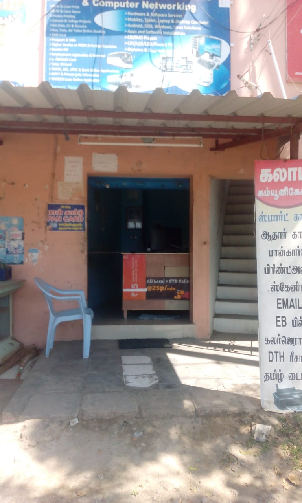

<html>
<marquee behavior="scroll" direction="left">  
கலாம்  தொடர்பு மற்றும் வலைப்பின்னல் - Welcome to Kalam Communication </marquee>
 </html>
 
# Welcome to Kalam Communication 
<html>
<body>

 
 
</body>
</html>

<html>
<marquee behavior="scroll" direction="left">  பள்ளி மற்றும் கல்லூரி ப்ராஜெக்ட்(Project) செய்து தரப்படும்</marquee>
</html>

<html>
<marquee behavior="scroll" direction="left">  	Xerox	A4-Paper-1page-1Rs, A3-Paper-1page-3Rs, Legal-Paper-1page-2Rs
</marquee>
</html>
 
<html>
<marquee behavior="scroll" direction="left">  	Printout	A4-Paper-1page-2Rs, A3-Paper-1page-6Rs, Legal-Paper-1page-3Rs
</marquee>
</html>

## List of Works
* Mobile repairing
* Xerox/Printout
* Online works

## Computer Hardware Work
* Desktop Computer repairing 
* Laptop repairing 

## Computer Software Work
* Desktop software Installation
* Laptop software Installation

## Operating System
* Windows7, Windows10
* Linux, DOS

## Computer programming 
<html>
<marquee behavior="scroll" direction="left">  Online and Offline Coaching will be started very soon.....</marquee>
</html>
* Computer painting, Drawing (For school students)
* Microsoft Word, Excel, Powerpoint (For 10, 12, Scholl students)
* [C-Program](https://www.programiz.com/c-programming) and [C++](https://www.programiz.com/cpp-programming) (For Arts, Science and Engineering College students)
* [Origin Software](https://www.originlab.com/) (For Arts, Science and Engineering College students)
* [Python Software](https://www.python.org/) (For Arts, Science and Engineering College students)
* [MATLAB Software](https://www.mathworks.com/products/matlab.html)(For Arts, Science and Engineering College students)
* [LABVIEW Software](https://www.ni.com/en-il/shop/labview.html) (For Arts, Science and Engineering College students)

[Computer Program Coaching Registration Form](https://github.com/siva198432/KalamCommunication/blob/master/studentregistration.html)

<html>
<body>
<h2>Computer Program Coaching Registration Form</h2>
<form action="https://github.com/siva198432/KalamCommunication/blob/master/Registration.php" method="get">
  First name: 
  <input type="text" name="firstname" value="Enter here">
   
  Last name: 
  <input type="text" name="lastname" value="Enter here">
    
  Phone Number: 
  <input type="text" name="mobilenumber" value="Enter here">
    
  <input type="submit" value="Submit">
</form> 
</body>
</html>

## Contact
**P Siva**,
Kalam Comunication,
PRC- Opposite, Sattur,
Tamil Nadu,
Cell No: 8056909978,
Email id : kalammccn@gmail.com

<html>
<a class="weatherwidget-io" href="https://forecast7.com/en/9d3677d91/sattur/" data-label_1="SATTUR" data-label_2="WEATHER" data-theme="original" >SATTUR WEATHER</a>

</html>

### [Location](https://www.google.com/maps/place/KALAM+CUMMUNICATION/@9.370225,77.913702,21z/data=!4m5!3m4!1s0x3b06cbc616f6c069:0x6d0e8b20634bf4e3!8m2!3d9.3681108!4d77.9152959)
